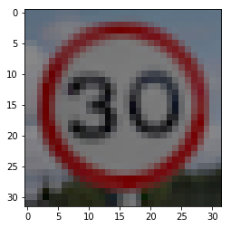

# Self-Driving Car Engineer Nanodegree

## Deep Learning

## Project: Build a Traffic Sign Recognition Classifier

In this notebook, a template is provided for you to implement your functionality in stages, which is required to successfully complete this project. If additional code is required that cannot be included in the notebook, be sure that the Python code is successfully imported and included in your submission if necessary.

> **Note**: Once you have completed all of the code implementations, you need to finalize your work by exporting the iPython Notebook as an HTML document. Before exporting the notebook to html, all of the code cells need to have been run so that reviewers can see the final implementation and output. You can then export the notebook by using the menu above and navigating to  \n",
    "**File -> Download as -> HTML (.html)**. Include the finished document along with this notebook as your submission.

In addition to implementing code, there is a writeup to complete. The writeup should be completed in a separate file, which can be either a markdown file or a pdf document. There is a [write up template](https://github.com/udacity/CarND-Traffic-Sign-Classifier-Project/blob/master/writeup_template.md) that can be used to guide the writing process. Completing the code template and writeup template will cover all of the [rubric points](https://review.udacity.com/#!/rubrics/481/view) for this project.

The [rubric](https://review.udacity.com/#!/rubrics/481/view) contains "Stand Out Suggestions" for enhancing the project beyond the minimum requirements. The stand out suggestions are optional. If you decide to pursue the "stand out suggestions", you can include the code in this Ipython notebook and also discuss the results in the writeup file.


>**Note:** Code and Markdown cells can be executed using the **Shift + Enter** keyboard shortcut. In addition, Markdown cells can be edited by typically double-clicking the cell to enter edit mode.

---
## Step 0: Load The Data


```python
import pickle
import os
import numpy as np
import csv
import random
import matplotlib.pyplot as plt
import copy
import cv2
import tensorflow as tf
from skimage import transform
from skimage.transform import warp, SimilarityTransform, AffineTransform
from skimage import exposure
from sklearn.utils import shuffle
from numpy import random
from tensorflow.contrib.layers import flatten
print("Packages has been Loaded")

# Load pickled data
# TODO: Fill this in based on where you saved the training and testing data

training_file='/home/carnd/Traffic-Sign-Classifier/train.p'

validation_file ='/home/carnd/Traffic-Sign-Classifier/valid.p'
testing_file = '/home/carnd/Traffic-Sign-Classifier/test.p'

with open(training_file, mode='rb') as f:
    train = pickle.load(f)
with open(validation_file, mode='rb') as f:
    valid = pickle.load(f)
with open(testing_file, mode='rb') as f:
    test = pickle.load(f)

X_train, y_train = train['features'], train['labels']
X_valid, y_valid = valid['features'], valid['labels']
X_test, y_test = test['features'], test['labels']
```

    Packages has been Loaded


```python
print()
print("Image Shape: {}".format(X_train[0].shape))
print()
print("Training Set:   {} samples".format(len(X_train)))
print("Validation Set: {} samples".format(len(X_valid)))
print("Test Set:       {} samples".format(len(X_test)))
```


    Image Shape: (32, 32, 3)

    Training Set:   34799 samples
    Validation Set: 4410 samples
    Test Set:       12630 samples


---

## Step 1: Dataset Summary & Exploration

The pickled data is a dictionary with 4 key/value pairs:

- `'features'` is a 4D array containing raw pixel data of the traffic sign images, (num examples, width, height, channels).
- `'labels'` is a 1D array containing the label/class id of the traffic sign. The file `signnames.csv` contains id -> name mappings for each id.
- `'sizes'` is a list containing tuples, (width, height) representing the original width and height the image.
- `'coords'` is a list containing tuples, (x1, y1, x2, y2) representing coordinates of a bounding box around the sign in the image. **THESE COORDINATES ASSUME THE ORIGINAL IMAGE. THE PICKLED DATA CONTAINS RESIZED VERSIONS (32 by 32) OF THESE IMAGES**

Complete the basic data summary below. Use python, numpy and/or pandas methods to calculate the data summary rather than hard coding the results. For example, the [pandas shape method](http://pandas.pydata.org/pandas-docs/stable/generated/pandas.DataFrame.shape.html) might be useful for calculating some of the summary results.

### Provide a Basic Summary of the Data Set Using Python, Numpy and/or Pandas


```python
### Replace each question mark with the appropriate value.
### Use python, pandas or numpy methods rather than hard coding the results

# TODO: Number of training examples
n_train = len(X_train)

# TODO: Number of validation examples
n_validation = len(X_valid)


# TODO: Number of testing examples.
n_test = len(X_test)


# TODO: What's the shape of an traffic sign image?
image_shape = X_train[0].shape

# TODO: How many unique classes/labels there are in the dataset.
n_classes = len(np.unique(y_train))

print("Number of training examples =", n_train)
print("Number of testing examples =", n_test)
print("Number of validation examples =", n_validation)
print("Image data shape =", image_shape)
print("Number of classes =", n_classes)
```

    Number of training examples = 34799
    Number of testing examples = 12630
    Number of validation examples = 4410
    Image data shape = (32, 32, 3)
    Number of classes = 43


### Include an exploratory visualization of the dataset

Visualize the German Traffic Signs Dataset using the pickled file(s). This is open ended, suggestions include: plotting traffic sign images, plotting the count of each sign, etc.

The [Matplotlib](http://matplotlib.org/) [examples](http://matplotlib.org/examples/index.html) and [gallery](http://matplotlib.org/gallery.html) pages are a great resource for doing visualizations in Python.

**NOTE:** It's recommended you start with something simple first. If you wish to do more, come back to it after you've completed the rest of the sections. It can be interesting to look at the distribution of classes in the training, validation and test set. Is the distribution the same? Are there more examples of some classes than others?


```python
### Data exploration visualization code goes here.
### Feel free to use as many code cells as needed.
import matplotlib.pyplot as plt
# Visualizations will be shown in the notebook.
%matplotlib inline
```

### Plotting bar charts for the data


```python
fig, ax = plt.subplots(figsize=(10,5))
width = 0.7
unique_tr, counts_tr = np.unique(y_train, return_counts=True)
plt.bar(unique_tr, counts_tr, width, alpha=0.5, label='train set', color='g')
plt.legend(loc='upper right')
ax.set_xlabel('Labels')
ax.set_ylabel('Count')

plt.show()
plt.savefig('/home/carnd/Traffic-Sign-Classifier/histogram_1.jpg')

fig, ax = plt.subplots(figsize=(10,5))
width = 0.7
unique_v, counts_v = np.unique(y_valid, return_counts=True)
plt.bar(unique_v, counts_v, width, alpha=1, label='validation set', color='r')
ax.set_xlabel('Labels')
ax.set_ylabel('Count')

plt.legend(loc='upper right')
plt.show()

plt.savefig('/home/carnd/Traffic-Sign-Classifier/histogram_2.jpg')

fig, ax = plt.subplots(figsize=(10,5))
width = 0.7
unique_t, counts_t = np.unique(y_test, return_counts=True)
plt.bar(unique_t, counts_t, width, alpha=1, label='test set', color='b')
plt.legend(loc='upper right')
ax.set_xlabel('Labels')
ax.set_ylabel('Count')

plt.savefig('/home/carnd/Traffic-Sign-Classifier/histogram_3.jpg')
plt.show()

```


    <matplotlib.figure.Figure at 0x7f646c8fc7f0>


    <matplotlib.figure.Figure at 0x7f646c5d1710>


### Data Set Summary & Exploration

###### I used the matplotlib library to calculate summary statistics of the traffic signs data set:

The size of training set is 34799 RGB images.
The size of the validation set is 4410 RGB images.
The size of test set is 12630 RGB images.
The shape of a traffic sign image is (32,32,3).
The number of unique classes/labels in the data set is 43.


### Getting the Labels from *sign-names.csv* file


```python
with open('signnames.csv', 'r') as f:
    reader = csv.reader(f)
    next(reader, None)
    sign_names = list(reader)

labels = np.unique(y_train)
for label in labels:
    label_indices = np.where(y_train==label)[0]
    fig = plt.figure(figsize=(10, 10))
    for i in range(10):
        rand_index = random.choice(label_indices)
        sub = fig.add_subplot(10, 10, i+1)
        sub.imshow(X_train[rand_index], interpolation='nearest')
    plt.suptitle(str(label) + ': ' + sign_names[label][1])
    plt.show()
```


----

## Step 2: Design and Test a Model Architecture

Design and implement a deep learning model that learns to recognize traffic signs. Train and test your model on the [German Traffic Sign Dataset](http://benchmark.ini.rub.de/?section=gtsrb&subsection=dataset).

The LeNet-5 implementation shown in the [classroom](https://classroom.udacity.com/nanodegrees/nd013/parts/fbf77062-5703-404e-b60c-95b78b2f3f9e/modules/6df7ae49-c61c-4bb2-a23e-6527e69209ec/lessons/601ae704-1035-4287-8b11-e2c2716217ad/concepts/d4aca031-508f-4e0b-b493-e7b706120f81) at the end of the CNN lesson is a solid starting point. You'll have to change the number of classes and possibly the preprocessing, but aside from that it's plug and play!

With the LeNet-5 solution from the lecture, you should expect a validation set accuracy of about 0.89. To meet specifications, the validation set accuracy will need to be at least 0.93. It is possible to get an even higher accuracy, but 0.93 is the minimum for a successful project submission.

There are various aspects to consider when thinking about this problem:

- Neural network architecture (is the network over or underfitting?)
- Play around preprocessing techniques (normalization, rgb to grayscale, etc)
- Number of examples per label (some have more than others).
- Generate fake data.

Here is an example of a [published baseline model on this problem](http://yann.lecun.com/exdb/publis/pdf/sermanet-ijcnn-11.pdf). It's not required to be familiar with the approach used in the paper but, it's good practice to try to read papers like these.

### Pre-process the Data Set (normalization, grayscale, etc.)

Minimally, the image data should be normalized so that the data has mean zero and equal variance. For image data, `(pixel - 128)/ 128` is a quick way to approximately normalize the data and can be used in this project.

Other pre-processing steps are optional. You can try different techniques to see if it improves performance.

Use the code cell (or multiple code cells, if necessary) to implement the first step of your project.


## Data preprocessing steps:

When we capture an image using your phone in the evening without flash, do we see how the image is a bit on the darker side? When we take an image with too many lights around you, the image becomes a bit too bright. Neither of the two situations gives us a good quality picture. The human eye likes contrast in images. What it means it that the bright regions should be really bright and the dark regions should be really dark. Almost all the apps and services you use today include this functionality, at least the good ones do. So how do we take one of these dark (or bright) images and improve its quality?  

##### 1.Equalize_histogram(image) applies CLAHE algortihm to RGB image

Well, one of the ways to achieve this is by using histogram equalization. When we take an image and apply histogram equalization to it, what we are essentially doing is manipulating the pixel values to make it look more pleasant or understandable. You look at all the pixel values in the image, and you extract the histogram of the image. A histogram basically tells you how many pixels you have for each possible pixel value.

In a typical grayscale image, the values range from 0 to 255. The X-axis on the histogram will contain values from 0 to 255, and the Y-axis will contain the number of pixels in the image for each value. In a dark image, you will have more pixels concentrated towards the lower end of the histogram. For example, the values may range from 0 to 100. In an image, we can actually have values from 0 to 255. So in essence, we are wasting the values from 101 to 255. During equalization, we take the values from 0 to 100 and stretch them to range from 0 to 255. This way, you are utilizing all the available values and the image will have much better contrast.

When you capture a color image, it is usually in the RGB format. Histogram equalization is applicable to a single channel image, and RGB image has three channels (Red, Blue and Green).

Histogram equalization is a non-linear process. Channel splitting and equalizing each channel separately is incorrect. Equalization involves intensity values of the image, not the color components. So for a simple RGB color image, histogram equalization cannot be applied directly on the channels. It needs to be applied in such a way that the intensity values are equalized without disturbing the color balance of the image. So, the first step is to convert the color space of the image from RGB into one of the color spaces that separates intensity values from color components. Some of the possible options are HSV/HLS, YUV, YCbCr, etc. YCbCr is preferred as it is designed for digital images. Perform histogram equalization on the intensity plane Y. Now convert the resultant YCbCr image back to RGB.

https://goo.gl/HaHRS4


```python
def equalize_histogram(image):
    image = image.astype(np.uint8)
    image_yuv = cv2.cvtColor(image, cv2.COLOR_BGR2YUV)

    # equalize the histogram of the Y channel
    clahe = cv2.createCLAHE(clipLimit=10.0, tileGridSize=(8,8))
    image_yuv[:,:,0] = clahe.apply(image_yuv[:,:,0])

    # convert the YUV image back to RGB format
    image_output = cv2.cvtColor(image_yuv, cv2.COLOR_YUV2BGR)
    return image_output


```

###### 2.normalisation(X) performs two steps:

  (i)equalize_histogram(image) for each image in X
  (ii)Linear image normalisation


Consider how a neural network learns its weights. C(NN)s learn by continually adding gradient error vectors (multiplied by a learning rate) computed from backpropagation to various weight matrices throughout the network as training examples are passed through.

The thing to notice here is the "multiplied by a learning rate".

If we didn't scale our input training vectors, the ranges of our distributions of feature values would likely be different for each feature, and thus the learning rate would cause corrections in each dimension that would differ (proportionally speaking) from one another. We might be over compensating a correction in one weight dimension while undercompensating in another.

This is non-ideal as we might find ourselves in a oscillating (unable to center onto a better maxima in cost(weights) space) state or in a slow moving (traveling too slow to get to a better maxima) state.

It is of course possible to have a per-weight learning rate, but it's yet more hyperparameters to introduce into an already complicated network that we'd also have to optimize to find. Generally learning rates are scalars.

Thus we try to normalize images before using them as input into NN (or any gradient based) algorithm.

https://goo.gl/WsiVSs


```python
def normalisation(X):
    X_n = np.empty(shape=X.shape)
    a = 0.1
    b = 0.9
    for i, img in enumerate(X):
        temp = equalize_histogram(img)
        X_max = np.amax(temp)
        X_min = np.amin(temp)
        X_n[i] = a + (temp - X_min)*(b - a)/(X_max - X_min)
    return X_n
```


```python
test_image = X_train[np.random.randint(0, X_train.shape[0])]
fig, axarray = plt.subplots(1,1)
axarray.imshow(test_image, interpolation='nearest')
axarray.set_title("Original image")
plt.show()
plt.savefig('Original.jpg', bbox_inches='tight')
plt.savefig('/home/carnd/Traffic-Sign-Classifier/Original.jpg')

fig, axarray = plt.subplots(1,1)
test_image_eqhist = equalize_histogram(test_image)
axarray.imshow(test_image_eqhist, interpolation='nearest')
axarray.set_title("Histogram" + '\n' + "equalisation")
plt.show()
plt.savefig('Histogram-Equlaization.jpg', bbox_inches='tight')

f, axarray = plt.subplots(1,1)
test_image_norm = normalisation(np.expand_dims(test_image, axis=0))
axarray.imshow(test_image_norm[0], interpolation='nearest')
axarray.set_title("Normalisation")
plt.show()
plt.savefig('Normalisation.jpg', bbox_inches='tight')


```


    <matplotlib.figure.Figure at 0x7f1e49d81a90>


    <matplotlib.figure.Figure at 0x7f1e45b916d8>


    <matplotlib.figure.Figure at 0x7f1e49bece48>


## Data augmentation and the Functions

Data processing in our case is done in two steps:

Adaptive histogram equalisation CLAHE. This method improves the image contrast by computing histograms for different parts, and redistributes lightness over the image. In the case of German Traffic Sign Database, many images are too dark or too bright, hence brightness balancing will potentially help to make datasets more uniform and improve classification accuracy.
The described procedure can be done in three steps (taken from here): * Conversion to YUV color space * CLAHE algorithm applied to Y channel * Conversion back to BGR color space

https://goo.gl/p1eX51


##### Data processing

The German Traffic Sign Database is very nonuniform in manner, which means some classes contain more images than others. In addition to that, the images that belongs to one class could change from a neural network point of view, thus the sign can be blurred, or shifted, or could be seen from different angles (which causes perspective distortion), etc. To model the data variations within a single class I decided to augment a dataset. Data augmentation was done in several ways:

1.Rotation by a random angle (between -20 and 20 degrees) - models basic uncertainty of the sign angle with respect to the picture frame.

2.Translations - models traffic signs at different positions on the picture

3.Affine transformation - models perspective distortion effect ()

4.Brightness variation - models variation of brightness level for original dataset
their combinations

The augmented dataset can be obtained in two ways:


*augment_brightness(image) - changes image brightness by a factor between 0.25 and 1.0 using opencv library*

https://goo.gl/FuiJwC


```python
def augment_brightness(image):
    image = image.astype(np.uint8)
    image1 = cv2.cvtColor(image,cv2.COLOR_RGB2HSV)
    random_bright = np.random.uniform(0.25, 1)
    image1[:,:,2] = image1[:,:,2]*random_bright
    image1 = cv2.cvtColor(image1,cv2.COLOR_HSV2RGB)
    return image1
```

*rotate_20_rand(X) - rotates image by random (between -20 and 20 degrees) angle using skimage.transform*


```python
def rotate_20_rand(X):
    result = 255*transform.rotate(X, angle=np.random.uniform(-20, 20), mode='edge')
    result = result.astype(np.uint8)
    return result

```

*translation(X) - translates image by $\pm$ 10 pixels using skimage.transform*


```python
def translation(X):
    result = 255*warp(X, transform.SimilarityTransform(translation=(np.random.uniform(-10, 10), np.random.uniform(-10, 10))),mode='edge')
    result = result.astype(np.uint8)
    return result
```

*affine_transform(X) - applies affine transform from skimage.transform with
randomly chosen parameters for shear angle and scale*


```python
def affine_transform(X):
    result = 255*warp(X,
                  transform.AffineTransform(scale=(np.random.uniform(0.7, 1.3), np.random.uniform(0.7, 1.3)), shear=np.random.uniform(-0.3, 0.3)),
                  mode='edge')
    result = result.astype(np.uint8)
    return result
```

*image_augment(X) - modify image by combining funcitons above*

Deep Neural Networks, particularly Convolutional Neural Networks (CNNs), are particularly proficient at image classification tasks. State-of-the-art CNNs have even been shown to exceed human performance in image recognition.

In order to combat the high expense of collecting thousands of training images, image augmentation has been developed in order to generate training data from an existing dataset. Image Augmentation is the process of taking images that are already in a training dataset and manipulating them to create many altered versions of the same image. This both provides more images to train on, but can also help expose our classifier to a wider variety of lighting and coloring situations so as to make our classifier more robust. Here are some examples of different augmentations from the imgaug library.


```python
def image_augment(X):
    n = np.random.randint(1,6)
    if n == 1:
        result = affine_transform(augment_brightness(X))
    elif n == 2:
        result = translation(augment_brightness(X)).astype(np.uint8)
    elif n == 3:
        result = rotate_20_rand(augment_brightness(X)).astype(np.uint8)
    elif n == 4:
        result = affine_transform(translation(X)).astype(np.uint8)
    elif n == 5:
        result = translation(rotate_20_rand(X)).astype(np.uint8)
    else:
        result = rotate_20rand(affine_transform(X)).astype(np.uint8)
    result = result.astype(np.uint8)
    return result
```


```python
test_image = X_train[np.random.randint(0, X_train.shape[0])]

```


```python
fig, axaxarray = plt.subplots(1,1)
axaxarray.imshow(test_image, interpolation='nearest')
axaxarray.set_title("Original" + '\n' + "image")
plt.show()
plt.savefig('/home/carnd/Traffic-Sign-Classifier/original.jpg')
```


    <matplotlib.figure.Figure at 0x7f1e4a0b3278>


```python
fig, axaxarray = plt.subplots(1,1)
axaxarray.imshow(augment_brightness(test_image), interpolation='nearest')
axaxarray.set_title("Brightness" +'\n' + "augmented")
plt.show()
plt.savefig('/home/carnd/Traffic-Sign-Classifier/brightness_augmented.jpg')
```


    <matplotlib.figure.Figure at 0x7f1e49a6d5c0>


```python
fig, axaxarray = plt.subplots(1,1)
axaxarray.imshow(rotate_20_rand(test_image), interpolation='nearest')
axaxarray.set_title("Rotation")
plt.show()
plt.savefig('/home/carnd/Traffic-Sign-Classifier/rotation.jpg')
```


    <matplotlib.figure.Figure at 0x7f1e49dbc5f8>


```python
fig, axaxarray = plt.subplots(1,1)
axaxarray.imshow(translation(test_image), interpolation='nearest')
axaxarray.set_title("Translation")
plt.show()
plt.savefig('/home/carnd/Traffic-Sign-Classifier/Transalation.jpg')
```


    <matplotlib.figure.Figure at 0x7f1e45a0c978>


```python
fig, axaxarray = plt.subplots(1,1)
axaxarray.imshow(affine_transform(test_image), interpolation='nearest')
axaxarray.set_title("Affine" + '\n' + "transform")
plt.show()
plt.savefig('/home/carnd/Traffic-Sign-Classifier/Affine_Transformation.jpg')
```


    <matplotlib.figure.Figure at 0x7f1e497a9828>


```python
def set_augment(X):
    aug_X = np.empty(shape=X.shape, dtype=np.uint8)
    for i, img in enumerate(X):
        aug_X[i] = image_augment(img)
    return aug_X
```


```python
def settings_for_augment_balanced(X, y, N):
    labels = np.unique(y)
    aug_X_l = []
    aug_y_l = []
    for label in labels:
        label_indices = np.where(y==label)[0]
        noe = len(label_indices)
        if (N-noe < 0):
            print("No augmentation needed")
            continue
        aug_X = np.empty([N-noe, 32, 32, 3], dtype=np.uint8)
        aug_y = np.empty([N-noe], dtype=np.uint8)
        i = 0
        while(N - noe > 0):
            aug_X[i] = image_augment(X[np.random.choice(label_indices)])
            aug_y[i] = label
            noe+=1
            i+=1
        aug_X_l.append(aug_X)
        aug_y_l.append(aug_y)
    return np.vstack(aug_X_l), np.hstack(aug_y_l)
```

##### Perform normalisation for X_valid and X_test. Normalisation and augmentation of X_train will be performed during training


```python
data_train_list = []
label_train_list = []
```

##### For Creating a Balanced Dataset

#### Unbalanced Set Augmentation.
I randomly apply the transformations listed above to each element of the original dataset and stack them together (function set_augment). The augmented dataset contains two times more images than the original one, i.e. its shape(69598, 32, 32, 3) and has the same distribution of sign images across the sign types.

#### Balanced Set Augmentation
Balanced set augmentation (set_augment_balanced), i.e. transformations applied to the images of each class in such a way that the augmented set has uniform distribution of images across the classes.


```python
for i in range(3):
    data_train_list.append(normalisation(np.vstack((X_train, set_augment(X_train)))))
    label_train_list.append(np.hstack((y_train, y_train)))    
```


```python
X_bal, y_bal = settings_for_augment_balanced(X_train, y_train, N=2000)
data_train_list.append(normalisation(np.vstack((X_train, X_bal))))
label_train_list.append(np.hstack((y_train, y_bal)))
X_valid = normalisation(X_valid)
print("X_valid processing: done")
X_test = normalisation(X_test)
print("X_test processing: done")
print('Images are preprocessed.')
```

    No augmentation needed
    X_valid processing: done
    X_test processing: done
    Images are preprocessed.


### Model Architecture


```python
def Convolution_Network_three_stage(x, keep_prob):    

    mu = 0
    sigma = 0.1    
    f1_h = 5
    f1_w = f1_h    
    f2_h = 3
    f2_w = f2_h
    #initialize the weights
    W = {
        'wc1': tf.Variable(tf.truncated_normal([f1_h, f1_w, 3, 18], mu, sigma)),
        'wc2': tf.Variable(tf.truncated_normal([f2_h, f2_w, 18, 48], mu, sigma)),
        'wc3': tf.Variable(tf.truncated_normal([f2_h, f2_w, 48, 96], mu, sigma)),
        'wfc1': tf.Variable(tf.truncated_normal([5640, 688], mu, sigma)),
        'wfc2': tf.Variable(tf.truncated_normal([688, 86], mu, sigma)),
        'wfc3': tf.Variable(tf.truncated_normal([86, 43], mu, sigma)),}
    #initialize the bias
    b = {
        'bc1': tf.Variable(tf.zeros([18])),
        'bc2': tf.Variable(tf.zeros([48])),
        'bc3': tf.Variable(tf.zeros([96])),
        'bfc1': tf.Variable(tf.zeros([688])),
        'bfc2': tf.Variable(tf.zeros([86])),
        'bfc3': tf.Variable(tf.zeros([43]))}

    kp = 2

    strides = [1, 1, 1, 1];

    # Layer 1: Convolutional.
    # Input = 32x32x3. Filters: 5x5x18.
    # Output = 28x28x18.
    # ReLU Activation.

    conv1 = tf.nn.conv2d(x, W['wc1'], strides=strides, padding='VALID')
    conv1 = tf.nn.bias_add(conv1, b['bc1'])
    conv1 = tf.nn.relu(conv1)

    # Max Pooling.
    #Input = 28x28x18.
    #Output = 14x14x18.

    conv1 = tf.nn.max_pool(conv1, [1, kp, kp, 1], [1, kp, kp, 1], padding='SAME')

    # Layer 2: Convolutional.
    # Input = 14x14x18.
    # Filters: 3x3x3.
    # Output = 12x12x48.
    # ReLU Activation.

    conv2 = tf.nn.conv2d(conv1, W['wc2'], strides=strides, padding='VALID')
    conv2 = tf.nn.bias_add(conv2, b['bc2'])
    conv2 = tf.nn.relu(conv2)

    # Max Pooling.
    # Input = 12x12x48.
    # Output = 6x6x48.

    conv2 = tf.nn.max_pool(conv2, [1, kp, kp, 1], [1, kp, kp, 1], padding='SAME')

    # Layer 3: Convolutional.
    # Input = 6x6x48.
    # Filters: 3x3x3.
    # Output = 4x4x96.
    # ReLU Activation.

    conv3 = tf.nn.conv2d(conv2, W['wc3'], strides=strides, padding='VALID')
    conv3 = tf.nn.bias_add(conv3, b['bc3'])
    conv3 = tf.nn.relu(conv3)

    # Max Pooling.
    # Input = 4x4x96.
    # Output = 2x2x96.

    conv3 = tf.nn.max_pool(conv3, [1, kp, kp, 1], [1, kp, kp, 1], padding='SAME')

    # Flatten.
    # Input = 2x2x96 and 6x6x48 and 14x14x18.
    # Output = 5640.

    fc1_1 = tf.contrib.layers.flatten(conv1)
    fc1_2 = tf.contrib.layers.flatten(conv2)
    fc1_3 = tf.contrib.layers.flatten(conv3)
    fc1 = tf.concat(1, [fc1_1, fc1_2, fc1_3])

    # Layer 4: Fully Connected.
    # Input = 5640.
    # Output = 688.
    # ReLU Activation.

    fc1 = tf.add(tf.matmul(fc1, W['wfc1']), b['bfc1'])
    fc1 = tf.nn.relu(fc1)

    # Dropout
    fc1 = tf.nn.dropout(fc1, keep_prob=keep_prob)

    # Layer 5: Fully Connected.
    # Input = 688.
    # Output = 86.
    # ReLU Activation.

    fc2 = tf.add(tf.matmul(fc1, W['wfc2']), b['bfc2'])
    fc2 = tf.nn.relu(fc2)

    # Dropout
    fc2 = tf.nn.dropout(fc2, keep_prob=keep_prob)

    # Layer 6: Output.
    # Input = 86.
    # Output = 43.
    logits = tf.add(tf.matmul(fc2, W['wfc3']), b['bfc3'])

    return logits
```

### Train, Validate and Test the Model

A validation set can be used to assess how well the model is performing. A low accuracy on the training and validation
sets imply underfitting. A high accuracy on the training set but low accuracy on the validation set implies overfitting.


```python
### Train your model here.
### Calculate and report the accuracy on the training and validation set.
### Once a final model architecture is selected,
### the accuracy on the test set should be calculated and reported as well.
### Feel free to use as many code cells as needed.

EPOCHS = 100
BATCH_SIZE = 128

# Labels and features
x = tf.placeholder(tf.float32, (None, 32, 32, 3))
y = tf.placeholder(tf.int32, (None))
one_hot_y = tf.one_hot(y, 43)

# Dropout parameter
keep_prob = tf.placeholder(tf.float32) # probability to keep units
```


```python
logits = Convolution_Network_three_stage(x, keep_prob)
```

The cross-entropy measure has been used as an alternative to squared error. Cross-entropy can be used as an error measure when a network's outputs can be thought of as representing independent hypotheses


```python
cross_entropy = tf.nn.softmax_cross_entropy_with_logits(labels=one_hot_y, logits=logits)
```


```python
loss_operation = tf.reduce_mean(cross_entropy)
```


```python
loss_op_batch = []
train_acc_batch = []
valid_acc_batch = []
```


```python
# Learning rate
learning_rate = tf.placeholder(tf.float32, shape=[])
rate = 0.001
optimizer = tf.train.AdamOptimizer(learning_rate = learning_rate)
```


```python
training_operation = optimizer.minimize(loss_operation)
```


```python
correct_prediction = tf.equal(tf.argmax(logits, 1), tf.argmax(one_hot_y, 1))
accuracy_operation = tf.reduce_mean(tf.cast(correct_prediction, tf.float32))
saver = tf.train.Saver()

def evaluate(X_data, y_data):
    num_examples = len(X_data)
    total_accuracy = 0
    sess = tf.get_default_session()
    for offset in range(0, num_examples, BATCH_SIZE):
        batch_x, batch_y = X_data[offset:offset+BATCH_SIZE], y_data[offset:offset+BATCH_SIZE]
        accuracy = sess.run(accuracy_operation, feed_dict={x: batch_x, y: batch_y, keep_prob: 1.0})
        total_accuracy += (accuracy * len(batch_x))
    return total_accuracy / num_examples
```


```python
with tf.Session() as sess:
    sess.run(tf.global_variables_initializer())

    print("The Training is in progression...")
    print()
    val = []
    train = []
    for i in range(EPOCHS):
        index = np.random.randint(0, len(data_train_list))
        if(index == 3):
            print("This is a Balanced dataset:")
        else:
            print("This is not a balanced dataset:")
        X_train_aug = data_train_list[index]
        y_train_aug = label_train_list[index]
        X_train_aug, y_train_aug = shuffle(X_train_aug, y_train_aug)
        num_examples = len(X_train_aug)

        if (i == 60):
            rate = 0.0001
            print("Learning rate: ", rate)
        elif (i == 80):
            rate = 0.00001
            print("Learning rate: ", rate)

        for offset in range(0, num_examples, BATCH_SIZE):
            end = offset + BATCH_SIZE
            batch_x, batch_y = X_train_aug[offset:end], y_train_aug[offset:end]
            sess.run(training_operation, feed_dict={x: batch_x, y: batch_y, keep_prob: 0.5, learning_rate: rate})   
        train_accuracy = evaluate(X_train_aug, y_train_aug)
        loss_op_batch.append(loss_operation)
        train_acc_batch.append(train_accuracy)
        val.append(validation_accuracy)
        valid_acc_batch.append(validation_accuracy)
        validation_accuracy = evaluate(X_valid, y_valid)
        train.append(train_accuracy)


        print("Train Accuracy = {:.3f}".format(train_accuracy*100)+'%')
        print("Validation Accuracy = {:.3f}".format(validation_accuracy*100)+'%')
        print("EPOCH {} ...".format(i+1))
        print()   

    saver.save(sess, './Three_stages_aug_rgb')
    print("Model is saved")


    Model is saved


```python
with tf.Session() as sess:
    saver.restore(sess, './Three_stages_aug_rgb')

    test_accuracy = evaluate(X_test, y_test)
    print("Test Accuracy = {:.3f}".format(test_accuracy*100) +'%')
```

    Test Accuracy = 97.680%


```python
x_axis = range(1, EPOCHS+1)
plt.axis([0, 100, 0.7, 1])
plt.step(x_axis, train, label='Train accuracy', color ='b')
plt.step(x_axis, val, label='Validation accuracy', color = 'r')
plt.legend(loc='lower right')
plt.show()
plt.savefig('/home/carnd/Traffic-Sign-Classifier/Accuracy.jpg')
```


    <matplotlib.figure.Figure at 0x7f1e45dc9278>


---

## Step 3: Test a Model on New Images

To give yourself more insight into how your model is working, download at least five pictures of German traffic signs from the web and use your model to predict the traffic sign type.

You may find `signnames.csv` useful as it contains mappings from the class id (integer) to the actual sign name.

### Load and Output the Images


```python
### Load the images and plot them here.
### Feel free to use as many code cells as needed.
def load_images(folder):
    images = []
    for filename in os.listdir(folder):
        img = cv2.imread(os.path.join(folder,filename))
        if img is not None:
            images.append(image_augment(img))
    return images

images = load_images('/home/carnd/Traffic-Sign-Classifier_Submission/Downloaded_Signs')

# Resize images and stack them
for i, image in enumerate(images):
    temp = np.copy(image)
    temp = cv2.cvtColor(temp, cv2.COLOR_BGR2RGB)
    images[i] = np.expand_dims(cv2.resize(temp, (32, 32)), axis=0)

im_data = np.vstack(images)
for i, image in enumerate(im_data):
    plt.figure()
    plt.imshow(image)
    plt.savefig(str(i) + '_original.jpg', bbox_inches='tight')
    plt.show()
```





### Predict the Sign Type for Each Image


```python
### Run the predictions here and use the model to output the prediction for each image.
### Make sure to pre-process the images with the same pre-processing pipeline used earlier.
### Feel free to use as many code cells as needed.
with open('signnames.csv', 'r') as f:
    reader = csv.reader(f)
    next(reader, None)
    sign_names = list(reader)

y_data = np.array([25,25,36,17,0,1,17,5,3,1,7,38,12,13,18])

im_data_norm = normalisation(im_data)

with tf.Session() as sess:
    saver.restore(sess, './Three_stages_aug_rgb')
    scores = sess.run(logits, feed_dict={x: im_data_norm, keep_prob: 1.0})
    predictions = sess.run(correct_prediction, feed_dict={x: im_data_norm, y: y_data, keep_prob: 1.0})

top_scores = np.argmax(scores, 1)


for i in range(len(y_data)):
    print('Correct label: ' + sign_names[y_data[i]][1] + '-' + str(y_data[i]))
    print('Predicted label: ' + sign_names[top_scores[i]][1] + '-' + str(top_scores[i]))
    print('Result: ', str(predictions[i]))
    print()
```

    Correct label: Road work-25
    Predicted label: Road work-25
    Result:  True

    Correct label: Road work-25
    Predicted label: Road work-25
    Result:  True

    Correct label: Go straight or right-36
    Predicted label: Go straight or right-36
    Result:  True

    Correct label: No entry-17
    Predicted label: No entry-17
    Result:  True

    Correct label: Speed limit (20km/h)-0
    Predicted label: Speed limit (20km/h)-0
    Result:  True

    Correct label: Speed limit (30km/h)-1
    Predicted label: Speed limit (30km/h)-1
    Result:  True

    Correct label: No entry-17
    Predicted label: No entry-17
    Result:  True

    Correct label: Speed limit (80km/h)-5
    Predicted label: Speed limit (20km/h)-0
    Result:  False

    Correct label: Speed limit (60km/h)-3
    Predicted label: Speed limit (60km/h)-3
    Result:  True

    Correct label: Speed limit (30km/h)-1
    Predicted label: Speed limit (30km/h)-1
    Result:  True

    Correct label: Speed limit (100km/h)-7
    Predicted label: Speed limit (100km/h)-7
    Result:  True

    Correct label: Keep right-38
    Predicted label: Keep right-38
    Result:  True

    Correct label: Priority road-12
    Predicted label: Yield-13
    Result:  False

    Correct label: Yield-13
    Predicted label: Yield-13
    Result:  True

    Correct label: General caution-18
    Predicted label: General caution-18
    Result:  True


### Analyze Performance


```python
### Calculate the accuracy for these 5 new images.
### For example, if the model predicted 1 out of 5 signs correctly, it's 20% accurate on these new images.
with tf.Session() as sess:
    saver.restore(sess, './Three_stages_aug_rgb')
    accuracy = sess.run(accuracy_operation, feed_dict={x: im_data_norm, y: y_data, keep_prob: 1.0})
    print("Accuracy of all unknown image-recognition = {}%".format(int(100*accuracy)))
```

    Accuracy of all unknown image-recognition = 86%


### Output Top 5 Softmax Probabilities For Each Image Found on the Web

For each of the new images, print out the model's softmax probabilities to show the **certainty** of the model's predictions (limit the output to the top 5 probabilities for each image). [`tf.nn.top_k`](https://www.tensorflow.org/versions/r0.12/api_docs/python/nn.html#top_k) could prove helpful here.

The example below demonstrates how tf.nn.top_k can be used to find the top k predictions for each image.

`tf.nn.top_k` will return the values and indices (class ids) of the top k predictions. So if k=3, for each sign, it'll return the 3 largest probabilities (out of a possible 43) and the correspoding class ids.

Take this numpy array as an example. The values in the array represent predictions. The array contains softmax probabilities for five candidate images with six possible classes. `tf.nn.top_k` is used to choose the three classes with the highest probability:

```
# (5, 6) array
a = np.array([[ 0.24879643,  0.07032244,  0.12641572,  0.34763842,  0.07893497,
         0.12789202],
       [ 0.28086119,  0.27569815,  0.08594638,  0.0178669 ,  0.18063401,
         0.15899337],
       [ 0.26076848,  0.23664738,  0.08020603,  0.07001922,  0.1134371 ,
         0.23892179],
       [ 0.11943333,  0.29198961,  0.02605103,  0.26234032,  0.1351348 ,
         0.16505091],
       [ 0.09561176,  0.34396535,  0.0643941 ,  0.16240774,  0.24206137,
         0.09155967]])
```

Running it through `sess.run(tf.nn.top_k(tf.constant(a), k=3))` produces:

```
TopKV2(values=array([[ 0.34763842,  0.24879643,  0.12789202],
       [ 0.28086119,  0.27569815,  0.18063401],
       [ 0.26076848,  0.23892179,  0.23664738],
       [ 0.29198961,  0.26234032,  0.16505091],
       [ 0.34396535,  0.24206137,  0.16240774]]), indices=array([[3, 0, 5],
       [0, 1, 4],
       [0, 5, 1],
       [1, 3, 5],
       [1, 4, 3]], dtype=int32))
```

Looking just at the first row we get `[ 0.34763842,  0.24879643,  0.12789202]`, you can confirm these are the 3 largest probabilities in `a`. You'll also notice `[3, 0, 5]` are the corresponding indices.


```python
### Print out the top five softmax probabilities for the predictions on the German traffic sign images found on the web.
### Feel free to use as many code cells as needed.

with tf.Session() as sess:
    saver.restore(sess, './Three_stages_aug_rgb')
    scores = sess.run(logits, feed_dict={x: im_data_norm, keep_prob: 1.0})
    scores = sess.run(tf.nn.softmax(logits=scores))
    scores_top5 = sess.run(tf.nn.top_k(scores, k=5))
```


```python
for i, image in enumerate(im_data):
    fig, (bar, img) = plt.subplots(2,1, sharey=False, figsize=(15,5))

    scores_top5_p = 0
    scores_top5_l = 1

    list_of_labels = list(scores_top5[scores_top5_l][i])

    prob = 100*scores_top5[scores_top5_p][i]
    y_position = np.arange(len(list_of_labels))
    top5_labels = (sign_names[k][1]+ ': ' + str(k) for k in list_of_labels)

    bar.barh(y_position, prob, align='center',
            color='green', ecolor='black')
    bar.set_yticks(y_position)
    bar.set_yticklabels(top5_labels)
    bar.invert_yaxis()  # labels read top-to-bottom
    bar.set_xlabel('Probability, %')
    bar.set_title('Neural Net output')

    img.imshow(image)
    img.set_title(sign_names[y_data[i]][1]+ ': ' + str(y_data[i]))
    plt.savefig(str(i)+'.jpg', bbox_inches='tight')
    plt.show()
```


> **Note**: Once you have completed all of the code implementations and successfully answered each question above, you may finalize your work by exporting the iPython Notebook as an HTML document. You can do this by using the menu above and navigating to  \n",
    "**File -> Download as -> HTML (.html)**. Include the finished document along with this notebook as your submission.

---

## Step 4 (Optional): Visualize the Neural Network's State with Test Images

 This Section is not required to complete but acts as an additional excersise for understaning the output of a neural network's weights. While neural networks can be a great learning device they are often referred to as a black box. We can understand what the weights of a neural network look like better by plotting their feature maps. After successfully training your neural network you can see what it's feature maps look like by plotting the output of the network's weight layers in response to a test stimuli image. From these plotted feature maps, it's possible to see what characteristics of an image the network finds interesting. For a sign, maybe the inner network feature maps react with high activation to the sign's boundary outline or to the contrast in the sign's painted symbol.

 Provided for you below is the function code that allows you to get the visualization output of any tensorflow weight layer you want. The inputs to the function should be a stimuli image, one used during training or a new one you provided, and then the tensorflow variable name that represents the layer's state during the training process, for instance if you wanted to see what the [LeNet lab's](https://classroom.udacity.com/nanodegrees/nd013/parts/fbf77062-5703-404e-b60c-95b78b2f3f9e/modules/6df7ae49-c61c-4bb2-a23e-6527e69209ec/lessons/601ae704-1035-4287-8b11-e2c2716217ad/concepts/d4aca031-508f-4e0b-b493-e7b706120f81) feature maps looked like for it's second convolutional layer you could enter conv2 as the tf_activation variable.

For an example of what feature map outputs look like, check out NVIDIA's results in their paper [End-to-End Deep Learning for Self-Driving Cars](https://devblogs.nvidia.com/parallelforall/deep-learning-self-driving-cars/) in the section Visualization of internal CNN State. NVIDIA was able to show that their network's inner weights had high activations to road boundary lines by comparing feature maps from an image with a clear path to one without. Try experimenting with a similar test to show that your trained network's weights are looking for interesting features, whether it's looking at differences in feature maps from images with or without a sign, or even what feature maps look like in a trained network vs a completely untrained one on the same sign image.
